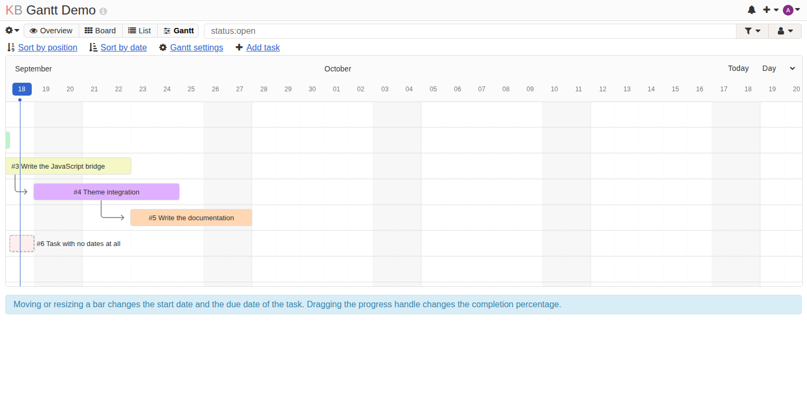
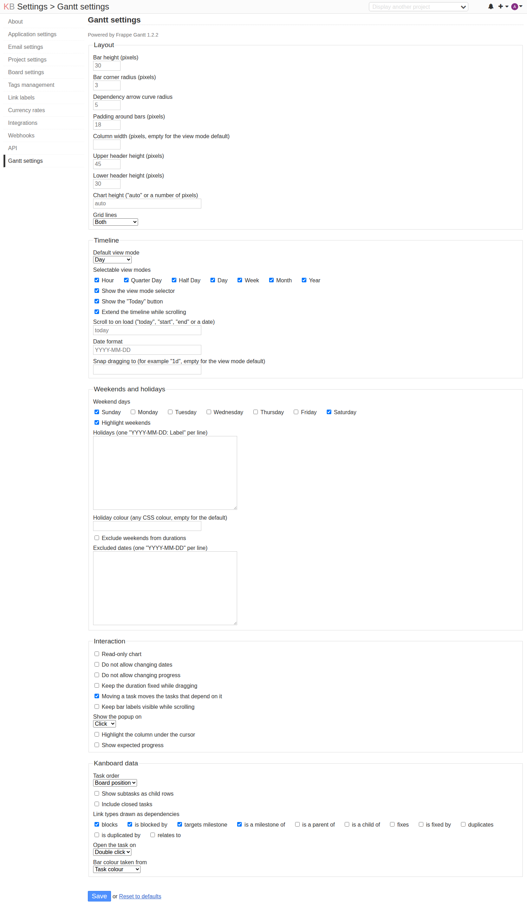

# Frappe Gantt for Kanboard

A [Kanboard](https://kanboard.org) plugin that renders projects, tasks and
subtasks with [Frappe Gantt](https://github.com/frappe/gantt), exposing the
library's complete feature set through Kanboard's settings and permissions.



## What it does

- **Three charts** — one per project, one across every project you can see, and
  one for the tasks assigned to you.
- **A task column beside the chart** — task ids and links that stay put while
  the timeline scrolls, with a dropdown for which extra fields to show and a
  draggable divider.
- **Editable in place** — drag a bar to change a task's start and due date,
  drag the progress handle to set its completion percentage. Everything is
  written straight back to Kanboard.
- **Dependency arrows** — drawn from Kanboard's own task links, so the chart
  reflects relationships you already maintain.
- **Every upstream option** — all of Frappe Gantt's options are configurable,
  globally and per project.
- **Milestones as diamonds** — tasks linked with "is a milestone of" are drawn
  the way every Gantt draws a milestone.
- **Zoom** — step through the view modes, or fit the whole plan to the window.
- **Critical path** — highlights the chain that decides when the plan
  finishes, off by default.
- **Edit dependencies from the chart** — right-click a bar to add or remove a
  predecessor, writing ordinary Kanboard task links.
- **Export and print** — download the chart as a PNG, or print it (and so
  save it as a PDF) with the page furniture stripped out.
- **Follows your theme** — light, dark and auto all work, and bars take their
  colour from the task or its category.

## Requirements

- Kanboard >= 1.2.20
- PHP >= 8.1

Works with every database Kanboard supports: SQLite, MySQL/MariaDB,
PostgreSQL and SQL Server (including the `dblib` and `odbc` drivers).

## Installation

Download the archive from the
[releases page](https://github.com/jarbid/kanboard_frappe-Gantt/releases) and
unpack it into your Kanboard `plugins` directory, so that `Plugin.php` sits at
`plugins/FrappeGantt/Plugin.php`. Or clone it:

```bash
cd /path/to/kanboard/plugins
git clone https://github.com/jarbid/kanboard_frappe-Gantt.git FrappeGantt
```

The directory **must** be named `FrappeGantt` — Kanboard derives the plugin's
namespace from it. The database table the plugin needs is created
automatically on the next request.

No build step is required: the Frappe Gantt library is bundled pre-built in
`Assets/vendor`.

## Usage

Once installed the plugin adds:

| Where | What |
| ----- | ---- |
| Project view switcher | **Gantt** — the chart for that project (keyboard: `v` then `g`) |
| Project list menu | **Gantt chart for all projects** |
| Dashboard sidebar | **My Gantt chart** |
| Settings sidebar | **Gantt settings** — the global configuration |
| Project settings sidebar | **Gantt settings** — per-project overrides |

Editing requires the same permission as editing the task itself: project
members can move bars and edit dependencies — the role Kanboard core itself
requires for task links — while project viewers get a read-only chart. Changing a
project's dates on the cross-project chart requires being a manager of that
project.

### How Kanboard concepts map onto the chart

| Chart concept | Kanboard source |
| ------------- | --------------- |
| Bar start / end | `date_started` and `date_due` |
| Progress | the plugin's own percentage, falling back to the task's board column position, and always 100% for a closed task |
| Dependency arrow | task links whose label is enabled in the settings |
| Bar colour | the task's colour, or its category's |
| Milestone diamond | a task linked with "is a milestone of" |
| Child rows | the task's subtasks, when enabled |

Kanboard has no percent-complete field, so dragging the progress handle stores
the value in a table this plugin owns (`frappegantt_task_progress`). Until a
task's progress is set that way, the chart shows the progress Kanboard derives
from the board column, exactly as the built-in views do. Deleting a task
removes its stored progress with it.

Tasks missing a start or due date are still drawn, as a dashed outline on the
day they do have (or today), so they stay visible instead of vanishing from
the plan. Dragging one sets both dates.

Subtasks carry no dates of their own in Kanboard, so they are drawn inside
their parent's range as read-only rows.

## Configuration

Every option Frappe Gantt exposes is configurable under **Settings > Gantt
settings**, and any project can override the whole set under its own
**Gantt settings**.



### Layout

`bar_height`, `bar_corner_radius`, `arrow_curve`, `padding`, `column_width`,
`upper_header_height`, `lower_header_height`, `container_height`, `lines`.

The task column is configured here too: whether it is shown
(`left_column`), how wide it starts (`left_column_width`) and which extra
fields it carries (`left_column_fields` — assignee, start, due, progress,
category, swimlane, column). The task id and its title are always shown.
Each user's own width and field choices are remembered in their browser, so
these settings are the starting point rather than a constraint.

### Timeline

`view_mode`, `view_mode_select`, `today_button`, `infinite_padding`,
`scroll_to`, `date_format`, `snap_at`, plus which of the seven view modes
(Hour, Quarter Day, Half Day, Day, Week, Month, Year) are offered.

`scroll_to` takes `today` (the default), `start`, `end`, a date, or `fit` to
frame the whole plan on load.

The view mode a user picks is remembered per chart in their browser. The
zoom buttons step through the enabled modes, and the fit button picks the
finest mode that still shows the whole plan.

### Weekends and holidays

Which days count as the weekend, whether to highlight them, a list of holidays
with labels, the colour to draw them in, and which dates to exclude from
duration calculations. This drives the library's `is_weekend`, `holidays` and
`ignore` options, which are functions and so cannot be expressed as plain
settings — the plugin builds them in the browser from these values.

Holidays are entered one per line as `YYYY-MM-DD` or `YYYY-MM-DD: Label`.

### Interaction

`readonly`, `readonly_dates`, `readonly_progress`, `fixed_duration`,
`move_dependencies`, `auto_move_label`, `popup_on`, `hover_on_date`,
`show_expected_progress`.

A user without write permission always gets a read-only chart, whatever these
say.

### Kanboard data

Task ordering (board position or start date), whether to show subtasks and
closed tasks, whether to highlight the critical path, which link types become
dependency arrows, what opens a task (double click, single click or nothing)
and where bar colours come from.

The critical path is worked out from the dependency graph and the durations,
per project. Tasks missing a start or due date take no part in it, since a
task with no duration cannot lengthen a chain. If the links form a cycle no
path is reported, because a cycle has no longest chain.

## Development

The plugin is plain PHP and plain JavaScript; there is nothing to compile to
work on it. Place it at `plugins/FrappeGantt` inside a Kanboard checkout.

### Tests

```bash
# from the Kanboard root, after composer install
./vendor/bin/phpunit -c tests/units.sqlite.xml   plugins/FrappeGantt/Test/
./vendor/bin/phpunit -c tests/units.postgres.xml plugins/FrappeGantt/Test/
./vendor/bin/phpunit -c tests/units.mysql.xml    plugins/FrappeGantt/Test/
```

### Cutting a release

The **Release** workflow builds the plugin archive and publishes it to the
releases page, which is where the install instructions point people. Run it
either way:

- Run the workflow manually from the Actions tab. It reads the version from
  `getPluginVersion()` in `Plugin.php` and creates the matching tag itself, so
  bumping that one value is all a release takes.
- Or push the tag yourself:

  ```bash
  git tag -a v1.2.3 -m "v1.2.3"
  git push origin v1.2.3
  ```

  Pushed this way the workflow refuses the tag if it disagrees with
  `getPluginVersion()`.

Either route checks that the archive unpacks to `FrappeGantt/Plugin.php` with
the bundled library and every database schema present, and that no development
files are in it. It refuses to overwrite an existing tag or release. `.gitattributes` keeps tests, docs and tooling out
of the build, so the archive holds only what a Kanboard installation loads.

To build the same archive locally:

```bash
make archive
```

The archive is named `FrappeGantt-<version>.zip` and unpacks to a single
`FrappeGantt/` directory, which is what the Kanboard plugin directory requires
of a `download` URL — a GitHub source archive will not do, because GitHub
appends the branch name to the folder and Kanboard then cannot load the
plugin.

### Listing on the Kanboard plugin directory

The directory is the `plugins.json` file in
[kanboard/website](https://github.com/kanboard/website). Adding the plugin
means opening a pull request there that inserts an entry, in alphabetical
order, pointing `download` at a release asset. `scripts/validate-plugins.py`
in that repository checks the ordering and the schema.

### Updating the bundled library

`Assets/vendor` holds a pre-built copy of Frappe Gantt so that installations
never need a JavaScript toolchain. Regenerate it with:

```bash
tools/build-vendor.sh [git-ref]
```

The script clones upstream at the pinned ref recorded in
`Assets/vendor/VERSION`, applies the patches in `tools/patches`, builds with
the project's own Vite config, and copies the result back.

### Patches carried on top of upstream

The bundled library is upstream's, with these fixes applied. They are kept as
individual patches so they stay visible and easy to drop once upstream
carries them.

- `0001-clamp-expected-progress.patch` — with `show_expected_progress` on, a
  task starting in the future produced a negative expected-progress value,
  which made the browser reject the corresponding `<rect>` and log an error.
  The value is now clamped to zero.

### Translations

`Locale/<locale>/translations.php` holds the plugin's strings; anything
Kanboard already translates is inherited. A test checks that every locale
file covers every string the plugin uses and contains no unused ones, so
adding a locale is a matter of copying `Locale/fr_FR/translations.php` and
translating the values.

## Credits

- [Frappe Gantt](https://github.com/frappe/gantt) by Frappe Technologies, MIT
  licensed. The bundled build and its licence are in `Assets/vendor`.
- [Kanboard](https://kanboard.org) by Frédéric Guillot.

## License

MIT — see [LICENSE](LICENSE).
